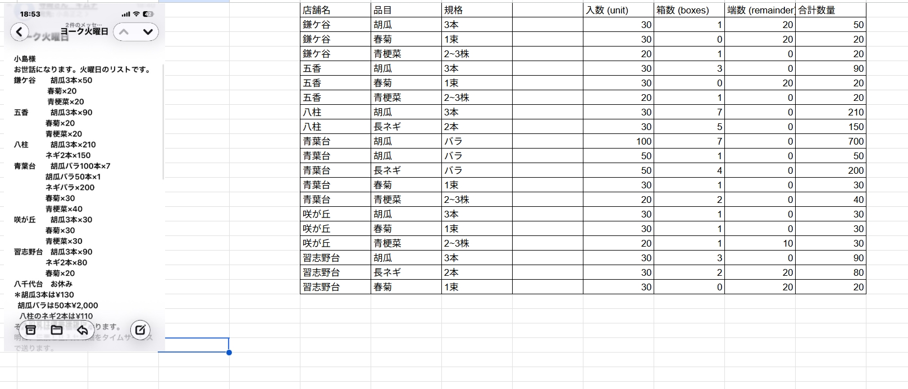

# 農業受注システム(v3) 計算ロジック仕様（受信方法分岐）

**この仕様は注文テキスト解析後の計算処理の正解仕様です。計算ロジック・プロンプト・テストを変更する際は必ず参照してください。添付の参照画像が正解データです。すべての実装はこの正解に合わせること。**

## 参照画像（正解データ・入出力のイメージ）

注文リスト（左）と解析結果テーブル（右）の対応が**正解データ**です。実装はこの結果に一致させる。

- 左: 注文テキスト（店舗別・品目×数量）
- 右: 出力テーブル（店舗名・品目・規格・入数・箱数・端数・合計数量）

### 正解データの例（画像と一致すること）

| 注文テキスト | 店舗 | 品目 | 規格 | 入数 | 箱数 | 端数 | 合計数量 | 根拠 |
|-------------|------|------|------|------|------|------|----------|------|
| 胡瓜3本×50 | 鎌ケ谷 | 胡瓜 | 3本 | 30 | 1 | 20 | 50 | 総数: total=50, 50÷30=1余20 |
| 胡瓜バラ100本×7 | 青葉台 | 胡瓜 | バラ | 100 | 7 | 0 | 700 | バラ数値指定: 100×7 |
| 胡瓜バラ50本×1 | 青葉台 | 胡瓜 | バラ | 50 | 1 | 0 | 50 | バラ数値指定: 50×1 |
| ネギバラ×200 | 青葉台 | 長ネギ | バラ | 50 | 4 | 0 | 200 | 総数: total=200, 200÷50=4 |
| 胡瓜平箱×2 | （例） | 胡瓜平箱 | 平箱 | 50 | 2 | 0 | 100 | 箱数: boxes=2, 2×50=100 |

---

## 1. 計算ロジックの分岐ルール

マスターデータの **`受信方法`**（総数 / 箱数）を参照し、注文テキストの「×」の後の数値（以下、`input_num`）を以下のように扱う。

### A. 受信方法が「総数」の場合（例：胡瓜3本、長ネギ2本、春菊1束 など）

指示書にある袋数やセット数を**合計数量**として扱う。

- **合計数量 (total_quantity)** = `input_num`
- **箱数 (boxes)** = `total_quantity // master_unit`（整数除算）
- **端数 (remainder)** = `total_quantity % master_unit`（余り）
- **例**: `胡瓜3本×50`（マスター入数30）→ 合計50、箱数1、端数20

### B. 受信方法が「箱数」の場合（例：胡瓜平箱、胡瓜バラ）

指示書にある数値をそのまま**箱数**として扱い、合計数量を逆算する。

- **箱数 (boxes)** = `input_num`
- **端数 (remainder)** = 0（原則）
- **合計数量 (total_quantity)** = `boxes * master_unit`
- **例**: `胡瓜平箱×2`（マスター入数50）→ 箱数2、合計100

---

## 2. 特殊例外：バラの数値指定

規格が「バラ」で、かつテキスト内に **「100本×7」** のように入数が明記されている場合：

- その行に限り、マスターの入数を無視して **入数 = 100** として計算する。
- **合計数量** = 100 × 7 = **700**

同様に「50本×1」の場合は 入数=50、箱数=1、合計50 とする。

---

## 3. 実装上の指示

- マスターデータ（辞書または DataFrame）の **`受信方法`** カラム（`receive_as_boxes` 等）を判別フラグとして使用する。
- 受注テキストを Gemini API または正規表現でパースする際、この「受信方法」に基づいた **`calculate_inventory`** を用いて計算する（`box_remainder_calc.calculate_inventory` および `order_processing._compute_from_input_num_by_reception` を参照）。
- 最終的な出力テーブルに、計算された「箱数」「端数」「合計数量」が正しく反映されるようにする。

---

## 関連ファイル

| ファイル | 役割 |
|----------|------|
| `box_remainder_calc.py` | `calculate_inventory(input_num, master_unit, receive_as_boxes, unit_override)` |
| `order_processing.py` | `_compute_from_input_num_by_reception(entries)` で受信方法に応じて計算 |
| `config_manager.py` | 品目・規格マスタの `receive_as_boxes`（受信方法） |
| `docs/計算ロジックと品質保証.md` | 不変条件・補正ルール・テスト要件 |

計算ロジックを変更する場合は、上記および `tests/test_box_remainder_calc.py`・`tests/test_order_processing.py` のテストが通ることを確認すること。
